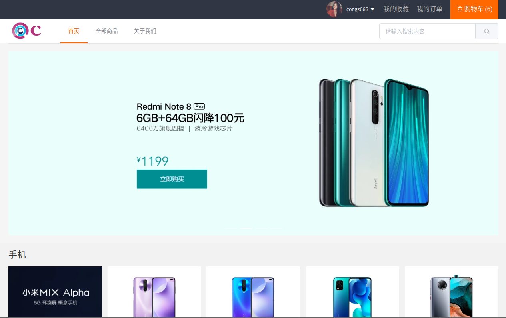
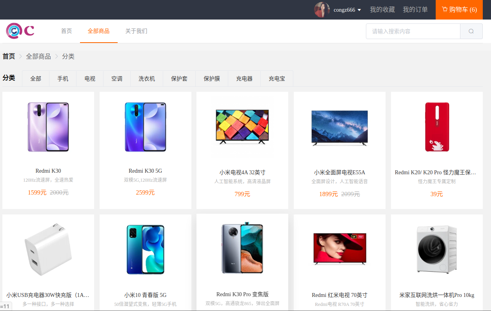
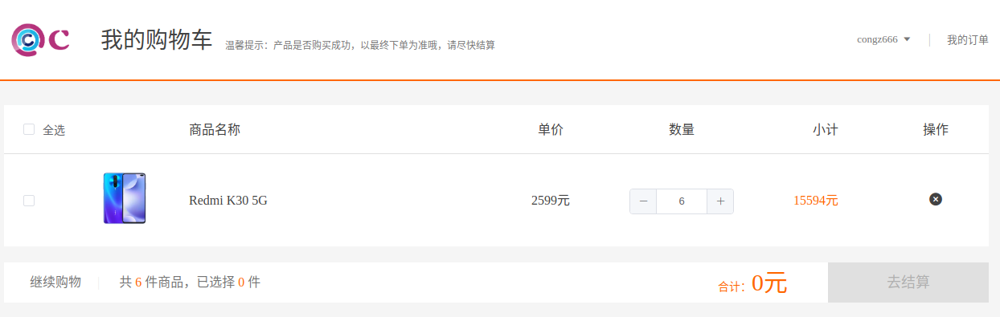
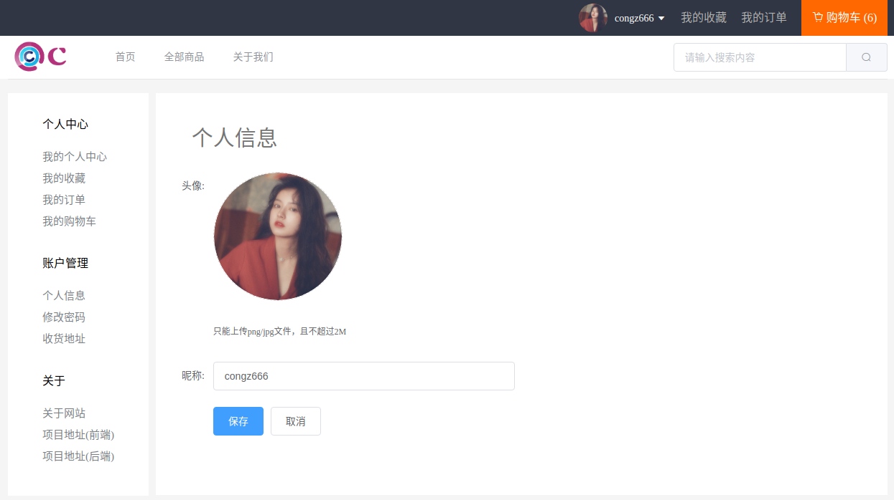

# CMall 电子商城

#### 基于 Vue 开发的小米商城前端界面[CMall](http://cmall.congz.top/#/)

#### 感谢 [hai-27](https://github.com/hai-27) 的开源 [vue-store](https://github.com/hai-27/vue-store) 项目提供前端页面及框架支持

#### 前端大部分内容已经重写以及加入了一些新功能

#### 后端全部用 golang 重写接口，后端接口项目请至 [cmall-go](https://github.com/congz666/cmall-go)

## 项目依赖

- Vue
- Vue-router
- Vuex
- Element-ui
- Axios

## 运行

```
git clone https://github.com/congz666/cmall-vue.git

cd cmall-vue
//运行
npm run serve
```

项目运行后启动在 8080 端口

## 图片展示

首页



登录


注册


全部商品



商品详情


收藏


订单


购物车



个人中心


个人信息


